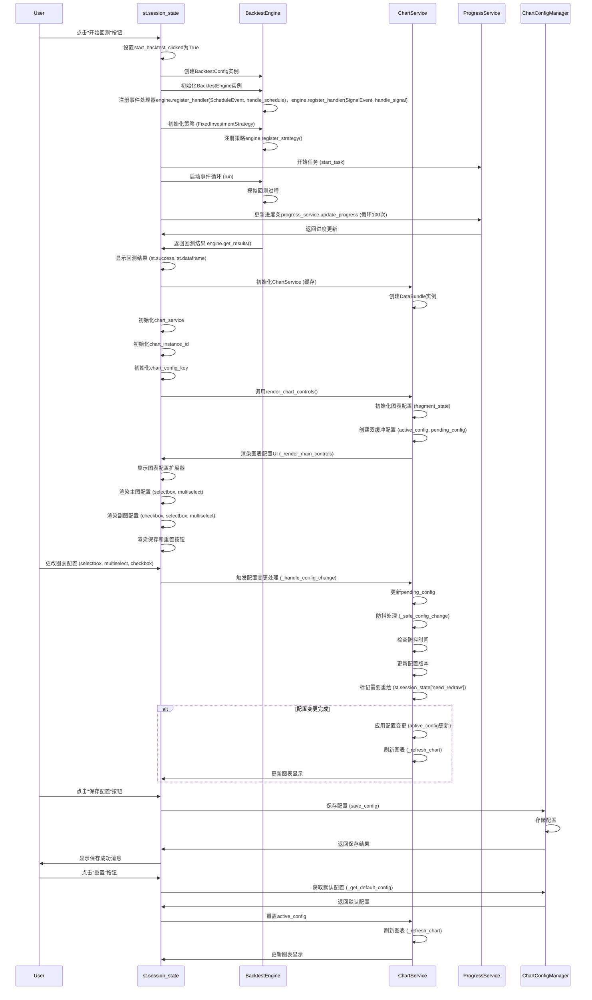

```mermaid
sequenceDiagram
    participant User
    participant st.session_state
    participant BacktestEngine
    participant ChartService
    participant ProgressService
    participant ChartConfigManager

    User->>st.session_state: 点击"开始回测"按钮
    st.session_state->>st.session_state: 设置start_backtest_clicked为True
    st.session_state->>BacktestEngine: 创建BacktestConfig实例
    st.session_state->>BacktestEngine: 初始化BacktestEngine实例

    BacktestEngine->>BacktestEngine: 注册事件处理器engine.register_handler(ScheduleEvent, handle_schedule)，engine.register_handler(SignalEvent, handle_signal)
    st.session_state->>BacktestEngine: 初始化策略 (FixedInvestmentStrategy)
    BacktestEngine->>BacktestEngine: 注册策略engine.register_strategy()
    st.session_state->>ProgressService: 开始任务 (start_task)
    
    st.session_state->>BacktestEngine: 启动事件循环 (run)
    BacktestEngine->>BacktestEngine: 模拟回测过程
    st.session_state->>ProgressService: 更新进度条progress_service.update_progress (循环100次)
    ProgressService->>st.session_state: 返回进度更新
    
    BacktestEngine->>st.session_state: 返回回测结果 engine.get_results()
    st.session_state->>st.session_state: 显示回测结果 (st.success, st.dataframe)
    

    st.session_state->>ChartService: 初始化ChartService (缓存)
    ChartService->>ChartService: 创建DataBundle实例
    st.session_state->>st.session_state: 初始化chart_service
    st.session_state->>st.session_state: 初始化chart_instance_id
    st.session_state->>st.session_state: 初始化chart_config_key
    
    st.session_state->>ChartService: 调用render_chart_controls()
    ChartService->>ChartService: 初始化图表配置 (fragment_state)
    ChartService->>ChartService: 创建双缓冲配置 (active_config, pending_config)
    ChartService->>st.session_state: 渲染图表配置UI (_render_main_controls)
    
    st.session_state->>st.session_state: 显示图表配置扩展器
    st.session_state->>st.session_state: 渲染主图配置 (selectbox, multiselect)
    st.session_state->>st.session_state: 渲染副图配置 (checkbox, selectbox, multiselect)
    st.session_state->>st.session_state: 渲染保存和重置按钮
    
    User->>st.session_state: 更改图表配置 (selectbox, multiselect, checkbox)
    st.session_state->>ChartService: 触发配置变更处理 (_handle_config_change)
    ChartService->>ChartService: 更新pending_config
    ChartService->>ChartService: 防抖处理 (_safe_config_change)
    
    ChartService->>ChartService: 检查防抖时间
    ChartService->>ChartService: 更新配置版本
    ChartService->>ChartService: 标记需要重绘 (st.session_state['need_redraw'])
    
    alt 配置变更完成
        ChartService->>ChartService: 应用配置变更 (active_config更新)
        ChartService->>ChartService: 刷新图表 (_refresh_chart)
        ChartService->>st.session_state: 更新图表显示
    end
    
    User->>st.session_state: 点击"保存配置"按钮
    st.session_state->>ChartConfigManager: 保存配置 (save_config)
    ChartConfigManager->>ChartConfigManager: 存储配置
    ChartConfigManager->>st.session_state: 返回保存结果
    st.session_state->>User: 显示保存成功消息
    
    User->>st.session_state: 点击"重置"按钮
    st.session_state->>ChartConfigManager: 获取默认配置 (_get_default_config)
    ChartConfigManager->>st.session_state: 返回默认配置
    st.session_state->>ChartService: 重置active_config
    ChartService->>ChartService: 刷新图表 (_refresh_chart)
    ChartService->>st.session_state: 更新图表显示
```