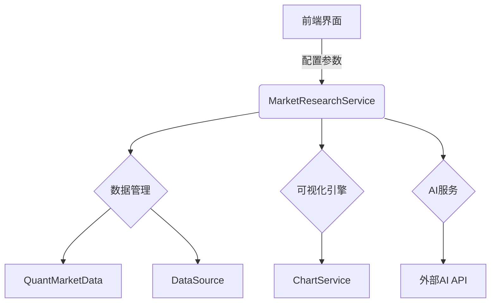
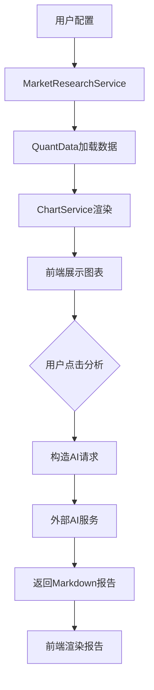

# 市场研究模块架构设计

## 1. 功能概述
本模块实现金融数据的可视化分析和AI智能解读功能，包含：
- 图表生成：支持多数据源、多图表类型的可视化
- AI分析：基于图表数据生成解读报告
- 报告管理：保存/分享分析结果

## 2. 系统架构


## 3. 核心模块设计

### 3.1 MarketResearchService (`src/services/market_research_service.py`)
```python
class MarketResearchService:
    def __init__(self, data_source: str):
        self.data_loader = DataFactory.create_loader(data_source)
        self.chart_service = ChartService()
        
    def generate_chart(
        self,
        symbol: str,
        fields: List[str],
        chart_type: str
    ) -> go.Figure:
        """
        生成指定图表
        :param symbol: 标的代码
        :param fields: 选择字段
        :param chart_type: 图表类型
        :return: Plotly图表对象
        """
        # 数据获取
        data = self.data_loader.load_data(symbol, fields)
        
        # 图表生成
        return self.chart_service.create_chart(data, chart_type)
    
    def generate_analysis_report(
        self,
        chart_config: dict,
        data_summary: dict
    ) -> str:
        """
        生成AI分析报告
        :param chart_config: 图表配置
        :param data_summary: 数据摘要
        :return: Markdown格式报告
        """
        # 构造AI请求
        ai_request = {
            "chart_type": chart_config["type"],
            "data_summary": data_summary,
            "indicators": chart_config.get("indicators", [])
        }
        
        # 调用AI服务
        return AIClient.generate_report(ai_request)
```

### 3.2 前端组件设计 (`src/frontend/market_research.py`)
```python
def show_market_research():
    # 数据源选择
    data_source = st.selectbox("数据源", ["公募", "私募", "非农数据"])
    
    # 字段选择 (动态加载)
    fields = load_available_fields(data_source)
    selected_fields = st.multiselect("分析字段", fields)
    
    # 图表类型选择
    chart_type = st.selectbox("图表类型", ["K线图", "热力图", "资金流向图"])
    
    # 生成图表
    if st.button("生成图表"):
        service = MarketResearchService(data_source)
        fig = service.generate_chart(current_symbol, selected_fields, chart_type)
        st.plotly_chart(fig)
        
        # 保存当前配置
        st.session_state.current_chart_config = {
            "data_source": data_source,
            "fields": selected_fields,
            "chart_type": chart_type
        }
    
    # AI分析按钮
    if st.button("AI分析") and "current_chart_config" in st.session_state:
        data_summary = create_data_summary(st.session_state.current_chart_config)
        report = service.generate_analysis_report(
            st.session_state.current_chart_config,
            data_summary
        )
        st.markdown(report)
```

## 4. 数据流设计


## 5. 与现有系统整合

### 5.1 数据兼容方案
```python
# src/core/data/market_research/quant_data.py
class QuantMarketData:
    def get_available_fields(self) -> List[str]:
        """返回当前数据源支持的字段"""
        return ["open", "high", "low", "close", "volume", "turnover"]
```

### 5.2 图表服务扩展
```python
# src/services/chart_service.py
class ChartService:
    def create_chart(self, data: DataBundle, chart_type: str) -> go.Figure:
        if chart_type == "热力图":
            return self.create_heatmap(data)
        elif chart_type == "资金流向图":
            return self.create_capital_flow(data)
        # ...其他图表类型
```

## 6. AI服务集成
- **请求格式**：
  ```json
  {
    "chart_type": "K线图",
    "data_summary": {
      "symbol": "SH600000",
      "date_range": ["2025-01-01", "2025-07-31"],
      "fields": ["open", "high", "low", "close"]
    },
    "indicators": ["MA5", "VOLUME"]
  }
  ```
- **响应格式**：Markdown文本

## 7. 实施计划
1. 实现`MarketResearchService`核心逻辑
2. 扩展`ChartService`支持新图表类型
3. 开发Streamlit前端组件
4. 集成AI服务接口
5. 编写单元测试