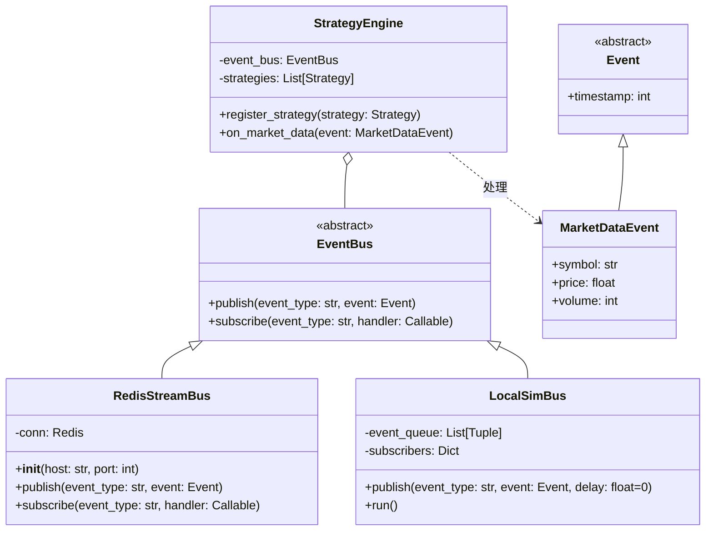

# 事件总线系统类图

```mermaid
classDiagram
    class EventBus {
        <<abstract>>
        +publish(event_type: str, event: Event)
        +subscribe(event_type: str, handler: Callable)
    }
    
    class RedisStreamBus {
        -conn: Redis
        +__init__(host: str, port: int)
        +publish(event_type: str, event: Event) 
        +subscribe(event_type: str, handler: Callable)
    }
    
    class LocalSimBus {
        -event_queue: List[Tuple]
        -subscribers: Dict
        +publish(event_type: str, event: Event, delay: float=0)
        +run()
    }
    
    class Event {
        <<abstract>>
        +timestamp: int
    }
    
    class MarketDataEvent {
        +symbol: str
        +price: float
        +volume: int
    }
    
    class StrategyEngine {
        -event_bus: EventBus
        -strategies: List[Strategy]
        +register_strategy(strategy: Strategy)
        +on_market_data(event: MarketDataEvent)
    }
    
    EventBus <|-- RedisStreamBus
    EventBus <|-- LocalSimBus
    Event <|-- MarketDataEvent
    StrategyEngine o-- EventBus
    StrategyEngine ..> MarketDataEvent : 处理
```
