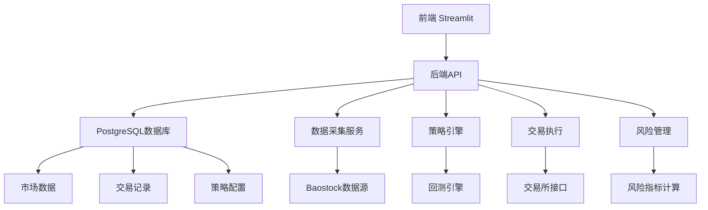

# 系统架构设计

## 1. 系统组件图

## 2. 数据流说明
1. 数据采集流程：
   - 前端请求 → 后端API → 数据采集服务 → Baostock数据源
   - 原始数据 → 数据标准化 → PostgreSQL存储

2. 交易流程：
   - 策略信号 → 交易执行 → 交易所接口
   - 交易结果 → 数据库记录 → 风险监控

3. 市场研究流程：
   - 研究数据 → 数据分析服务 → 可视化展示
   - 研究结果 → 策略优化 → 回测验证

## 3. 服务接口定义
### 数据服务接口
- GET /api/data/history?symbol={}&start={}&end={}
- GET /api/data/market/research?type={}

### 策略服务接口
- POST /api/strategy/backtest
- GET /api/strategy/performance

### 交易服务接口
- POST /api/trade/order
- GET /api/trade/history

### 市场研究接口
- POST /api/research/analyze
- GET /api/research/report

## 技术栈选择
数据层：PostgreSQL+Redis
应用层:Streamlit
部署层：Docker