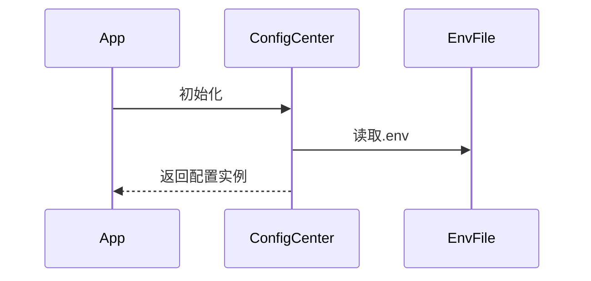

# 量化交易系统配置中心设计

## 1. 设计目标
- 统一管理所有配置项
- 支持多环境配置
- 类型安全的配置访问
- 热加载支持

## 2. 目录结构
```
src/config/
├── __init__.py       # 配置加载入口
├── base.py           # 基础配置
├── development.py    # 开发环境配置
├── production.py     # 生产环境配置
├── schemas.py        # 配置模型定义
└── utils.py          # 配置工具类
```

## 3. 核心类设计

### 3.1 配置模型 (schemas.py)
```python
from pydantic import BaseSettings

class DatabaseConfig(BaseSettings):
    host: str = "localhost"
    port: int = 3306
    user: str
    password: str
    
class RedisConfig(BaseSettings):
    url: str = "redis://localhost:6379/0"
```

### 3.2 配置加载器 (__init__.py)
```python
from .schemas import DatabaseConfig, RedisConfig

class ConfigCenter:
    def __init__(self):
        self.db = DatabaseConfig()
        self.redis = RedisConfig()
```

## 4. 配置加载流程


## 5. 迁移计划
1. 优先迁移数据库和Redis配置
2. 逐步迁移各模块配置
3. 保留旧配置3个月过渡期

## 6. 使用示例
```python
from src.config import config

print(config.db.host)  # 类型安全的访问