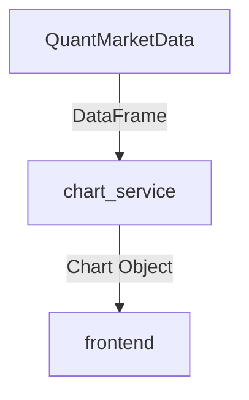

# 量化市场数据模块设计文档

## 1. 模块概述
提供从Yahoo Finance、Tushare等数据源获取量化市场数据的功能，支持数据清洗、标准化和存储。

## 2. 核心类说明

### 2.1 DatabaseConnection (协议)
```python
class DatabaseConnection(Protocol):
    """数据库连接协议"""
    def transaction(self) -> AsyncContextManager[Any]:
        """返回异步上下文管理器"""
    async def executemany(self, query: str, params: List[Any]) -> None:
        """批量执行SQL"""
    async def fetchval(self, query: str, *args) -> Any:
        """获取单个值"""
```

### 2.2 QuantMarketData
```python
class QuantMarketData:
    """量化市场数据获取器"""
```

#### 主要方法：
- `fetch_yahoo_data(symbol: str, **params)`: 从Yahoo Finance获取数据
- `fetch_tushare_data(symbol: str, **params)`: 从Tushare获取数据  
- `save_to_db(data: pd.DataFrame, symbol: str, frequency: str)`: 保存数据到数据库

## 3. 使用示例

### 3.1 初始化
```python
quant = QuantMarketData(
    api_key="your_api_key",
    base_url="https://api.example.com",
    db_conn=db_connection
)
```

### 3.2 获取数据
```python
# 获取Yahoo数据
data = await quant.fetch_yahoo_data("AAPL", start_date="2023-01-01")

# 获取Tushare数据 
data = await quant.fetch_tushare_data("600519.SH", frequency="1d")
```

### 3.3 保存数据
```python
success = await quant.save_to_db(data, "AAPL", "1d")
```

## 4. 数据存储结构
```sql
CREATE TABLE market_data (
    symbol VARCHAR(20),
    date TIMESTAMP,
    open DECIMAL(18,4),
    high DECIMAL(18,4),
    low DECIMAL(18,4),
    close DECIMAL(18,4),
    volume BIGINT,
    frequency VARCHAR(10),
    PRIMARY KEY (symbol, date, frequency)
);
```
## 5. 图表服务集成

### 5.1 数据流向


### 5.2 接口规范
```python
# chart_service.py核心接口
def render_quant_data(
    data: pd.DataFrame,
    chart_type: Literal["line","bar","scatter"],
    config: Optional[dict] = None
) -> Union[plt.Figure, dict]:
    """
    参数:
        data: 经处理后的DataFrame
        chart_type: 图表类型
        config: 图表配置项
        
    返回:
        matplotlib图形对象或前端可解析的图表数据
    """
```
