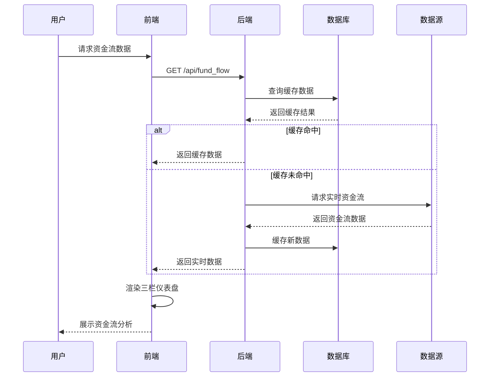

# 资金流数据时序图

## 数据流程说明
1. **用户请求**：通过前端界面触发资金流数据请求
2. **缓存检查**：后端优先检查数据库缓存
3. **实时获取**：缓存未命中时从数据源获取实时数据
4. **数据缓存**：新获取的数据存入数据库
5. **可视化渲染**：前端将数据渲染到三栏仪表盘

## 相关代码文件
- 数据获取：`src/core/data/baostock_source.py`
- 缓存处理：`src/core/data/database.py` 
- API接口：`src/backend/api/fund_flow.py`
- 前端展示：`src/frontend/dashboard.py`
